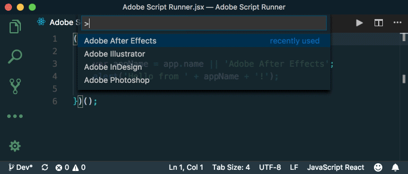

# Adobe Script Runner
Script runner for Adobe applications right from Atom.

## Supported applications

- Adobe After Effects
- Adobe ExtendScript Toolkit
- Adobe Illustrator
- Adobe InCopy
- Adobe InDesign
- Adobe Photoshop

## Features

Run commands are accessible via `Command Palette`. Simply click `Cmd+Shift+P` and start typing the name of `supported applications`. Click enter to run script inside the selected application.

Extension will open host application first if it's not running, and then execute the script.

> Tip: You don't need to have file saved inside Atom. Extension will be able to run code from unsaved documents. Kaboom!

Map keyboard shortcuts to execute script even faster - `Cmd+Alt+R` is bind to run script inside After Effects by default.

**Note:** Contribution to support other Adobe applications is highly encouraged.

## Installation

- ### ~~From Atom application~~
  - Package is not publick yet, so this does not work.

- ### From GitHub
  - Download repository and unzip the package.
  - Rename folder to `adobe-script-runner`.
  - Copy `adobe-script-runner` folder to `/Users/YOURUSER/.atom/packages` folder.

## In action

- Launch Atom and open your own jsx file, or for testing just type `alert("Hello World")`.
- Click `Cmd+Alt+R` on Mac or `Ctrl+Alt+R` on Windows or launch `Command Palette` with keyboard shortcut `Cmd+Shift+P` and type `Adobe After Effects` and click enter.
- Hopefully After Effects will fire up and run your script 🙏

## Settings

Click `Cmd+,` on Mac or `Ctrl+,` on Windows and navigate to `Packages > Adobe Script Runner` to modify settings. Extension exposes the following settings:

- `Save Dirty files`: toggle to automatically save dirty files before evaluating.
- `Run Untitles files`: toggle to save temporary file to destination defined in `Path to Temp File` section.
- `Path to Temp File`: saves untitled document to temporary file. Used only if `Run Untitled files` is enabled.

**For Windows users only:**

- `Path to ExtendScript Toolkit executable`: path to Adobe ExtendScript Toolkit executable (ExtendScript Toolkit.exe).
- `Path to After Effects executable`: path to Adobe After Effects executable (AfterFX.exe).
- `Path to Illustrator executable`: path to Adobe Illustrator executable (Illustrator.exe).
- `Path to Photoshop executable`: path to Adobe Photoshop executable (Photoshop.exe).

Executable paths for InCopy and InDesign for Windows are not exposed because they are handled differently than the rest of the apps. Go figure Adobe ¯\\\_(ツ)\_/¯

## Known issues

- Host application does not get focus on script run.